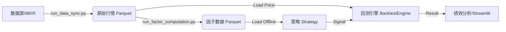
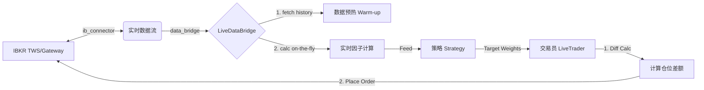

# 📈 Quantitative Multi-Factor Backtesting System (my_llm_backtester)

## 1. 项目愿景 (Project Vision)

本项目旨在构建一个**高性能、工程化、模块化**的量化回测框架。核心目标是支持多因子选股策略（Multi-Factor Selection）与 ETF 轮动策略的快速验证与迭代。

**核心架构特点：**

* 🚀 **离线预计算 (Pre-computation)**：彻底分离“因子计算”与“策略回测”。通过 `run_factor_computation.py` 实现因子的全量向量化计算与持久化存储，回测速度提升 **100x**。
* 🏗 **策略内聚 (Strategy Cohesion)**：采用依赖注入模式。策略类 (`BaseStrategy`) 自行持有数据并负责打分，回测引擎 (`BacktestEngine`) 仅专注于交易撮合。
* 💾 **高性能数据层**：基于 **DuckDB** 和 **Parquet** 构建本地数据仓库，支持海量行情与因子数据的秒级查询。
* 📊 **全栈可视化**：集成 Streamlit 前端，支持因子 EDA 分析、策略参数热调以及交互式绩效归因。
* ⚡ **实盘无缝切换**：采用适配器模式，通过 `LiveDataBridge` 复用回测策略逻辑，实现从回测到实盘的零代码修改迁移。

---

## 2. 当前进度 (Current Status)

**目前处于：阶段 4.0 - 实盘交易模块集成 (Live Trading Integrated)**

* ✅ **数据仓库**：DuckDB + Parquet 架构，支持增量同步 IBKR/外部数据。
* ✅ **因子工厂**：新增 `run_factor_computation.py`，支持 Xarray 全向量化计算，支持增量更新。
* ✅ **策略体系**：重构为 `quant_core/strategies/` 包。实现了 `LinearWeightedStrategy`（多因子线性加权 + 自动 Z-Score）。
* ✅ **回测引擎**：纯粹的事件驱动撮合引擎。
* ✅ **前端交互**：Streamlit 看板，支持内存级因子极速预览与回测。
* ✅ **实盘/模拟盘对接**：**[New]** 基于 `ib_insync` 实现 IBKR 对接。支持自动获取历史数据预热、实时计算因子、仓位差额计算与自动下单。

---

## 3. 系统架构与数据流 (Architecture & Workflow)

本框架采用**产线分离**与**双模式运行**的设计思想：

### 模式 A: 离线回测 (Backtest)



### 模式 B: 实盘/模拟盘 (Live Trading) **[New]**



---

## 4. 文件结构说明 (File Directory)

### 📂 根目录 (Root)

* **`run_live_strategy.py`**: **[✨ 新增: 实盘指挥官]**
* **作用**：实盘/模拟盘的主入口脚本。
* **流程**：连接 TWS -> 调用 Bridge 获取数据 -> 计算策略信号 -> 计算目标股数 -> 执行下单。
* **配置**：内置了实盘风控参数（止损、熔断）及因子配置。


* **`test_live_connection.py`**: **[✨ 新增: 连接测试]**
* **作用**：用于验证 IBKR 端口连接、数据权限及下单功能的健康检查脚本。


* **`run_factor_computation.py`**: **[因子工厂]**
* **作用**：负责“备菜”。读取全量行情，批量计算因子，并保存为 Parquet 文件。


* **`run_backtest.py`**: **[回测入口]**
* **作用**：命令行回测入口。直接读取硬盘上的离线因子数据，极速运行回测。


* **`app.py`**: **[Web 前端]**
* **作用**：Streamlit 可视化界面。


### 📂 quant_core (核心逻辑包)

#### 🔹 `quant_core/live/` (实盘模块 - 新增) **[New]**

* **`ib_connector.py`**: **[底层驱动]**
* 基于 `ib_insync` 封装。负责与 TWS 建立连接、保持心跳、发送原始 API 请求（行情订阅、下单）。


* **`data_bridge.py`**: **[数据适配器]**
* **核心组件**。解决回测与实盘的数据差异。
* **功能**：自动获取足够的历史窗口数据（Lookback Window），在内存中实时复现因子的计算逻辑（On-the-fly Calculation），确保实盘信号与回测逻辑一致。


* **`trader.py`**: **[交易执行器]**
* **功能**：负责“差额交易”。获取当前真实持仓，对比策略目标持仓，计算差值并发出买卖指令。


#### 🔹 `quant_core/strategies/` (策略库)

* **`base.py`**: **[策略基类]**
* 定义标准接口。新增了风控模块（Circuit Breaker, Stop Loss）。


* **`rules.py`**: **[线性策略]**
* 实现了基于权重的多因子选股逻辑。


#### 🔹 `quant_core/visualization/` (可视化)

* **`performance.py`**: **[图表组件]**
* 包含了净值曲线、水下回撤图、月度热力图等 Plotly绘图逻辑。


---

## 5. 快速开始 (Quick Start)

### 场景一：离线回测 (Backtest)

1. **准备配置**：修改 `config.yaml`。
2. **生产因子**：`python run_factor_computation.py`
3. **运行回测**：`python run_backtest.py` 或 `streamlit run app.py`

### 场景二：实盘/模拟盘交易 (Live Trading) **[New]**

**前置条件：**

1. 打开 **TWS (Trader Workstation)** 或 **IB Gateway**。
2. 配置 API：勾选 `Enable ActiveX and Socket Clients`，端口设置为 `7497` (Paper) 或 `7496` (Live)。
3. 确保安装依赖：`pip install ib_insync`。

**步骤：**

1. **连接测试** (首次运行推荐)：
```bash
python test_live_connection.py

```


*确保能看到绿色的 "Connected" 和测试下单日志。*
2. **启动自动交易**：
```bash
python run_live_strategy.py

```


*脚本将自动拉取数据、计算因子并根据策略执行调仓。*

---

## 6. 后续规划 (Roadmap)

### 🚀 短期目标 (Short-term)

1. **实盘定时任务**：引入 `schedule` 或 `APScheduler`，实现美股交易时段的自动定投或收盘轮动。
2. **扩展因子库**：将更多的 Alpha101 和 Eric 系列自定义因子录入 `definitions.py`。

### 🌟 中期目标 (Mid-term)

1. **机器学习策略 (ML Strategy)**：
* 新增 `quant_core/strategies/ml_strategy.py`。
* 利用 `XGBoost` / `LightGBM` 替代现有的 `LinearWeightedStrategy` 进行打分预测。


2. **实盘看板 (Live Dashboard)**：在 Streamlit 中新增 "Live" 页面，实时监控实盘账户的 PnL、持仓风险暴露。