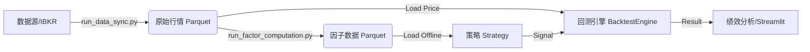

# 📈 Quantitative Multi-Factor Backtesting System (my_llm_backtester)

## 1. 项目愿景 (Project Vision)

本项目旨在构建一个**高性能、工程化、模块化**的量化回测框架。核心目标是支持多因子选股策略（Multi-Factor Selection）与 ETF 轮动策略的快速验证与迭代。

**核心架构特点：**

* 🚀 **离线预计算 (Pre-computation)**：彻底分离“因子计算”与“策略回测”。通过 `run_factor_computation.py` 实现因子的全量向量化计算与持久化存储，回测速度提升 **100x**。
* 🏗 **策略内聚 (Strategy Cohesion)**：采用依赖注入模式。策略类 (`BaseStrategy`) 自行持有数据并负责打分，回测引擎 (`BacktestEngine`) 仅专注于交易撮合。
* 💾 **高性能数据层**：基于 **DuckDB** 和 **Parquet** 构建本地数据仓库，支持海量行情与因子数据的秒级查询。
* 📊 **全栈可视化**：集成 Streamlit 前端，支持因子 EDA 分析、策略参数热调以及交互式绩效归因。

---

## 2. 当前进度 (Current Status)

**目前处于：阶段 3.0 - 高性能架构重构完成**

* ✅ **数据仓库**：DuckDB + Parquet 架构，支持增量同步 IBKR/外部数据。
* ✅ **因子工厂**：新增 `run_factor_computation.py`，支持 Xarray 全向量化计算，支持增量更新（智能跳过已存在因子）。
* ✅ **策略体系**：重构为 `quant_core/strategies/` 包。实现了 `LinearWeightedStrategy`（多因子线性加权 + 自动 Z-Score）。
* ✅ **回测引擎**：已瘦身。移除了内置计算逻辑，改为纯粹的事件驱动撮合引擎。
* ✅ **前端交互**：`app.py` 已适配新架构，支持内存级因子极速预览与回测。

---

## 3. 系统架构与数据流 (Architecture & Workflow)

本框架采用**产线分离**的设计思想：



1. **数据同步**：获取 OHLCV 数据。
2. **因子生产**：批量计算因子，存入 `data/processed/factors/`。
3. **策略装载**：策略读取离线因子文件。
4. **回测执行**：引擎撮合交易，生成净值曲线。

---

## 4. 文件结构说明 (File Directory)

### 📂 根目录 (Root)

* **`run_factor_computation.py`**: **[✨ 核心组件: 因子工厂]**
* **作用**：负责“备菜”。读取全量行情，批量计算因子（如 RSI, Momentum），并保存为 Parquet 文件。
* **特性**：支持增量更新（`--force` 强制重算，默认跳过已存在）。


* **`run_backtest.py`**: **[脚本入口]**
* **作用**：命令行回测入口。直接读取硬盘上的离线因子数据，极速运行回测。


* **`app.py`**: **[Web 前端]**
* **作用**：Streamlit 可视化界面。支持因子 EDA、参数调整、图表绘制及 Excel 报告下载。


* **`run_data_sync.py`**: **[数据同步]**
* **作用**：连接外部接口下载最新行情数据。


* **`config.yaml`**: **[全局配置]**
* **作用**：配置回测时间、资金、费率以及**因子权重**。


### 📂 quant_core (核心逻辑包)

#### 🔹 `quant_core/strategies/` (策略库 - 新架构)

* **`base.py`**: **[策略基类]**
* 定义标准接口：`load_data()` (注入数据), `on_bar()` (生成信号), `calculate_weights()` (组合构建)。


* **`rules.py`**: **[线性策略实现]**
* **`LinearWeightedStrategy`**：实现了传统多因子逻辑。
* **逻辑**：读取因子 -> Z-Score 标准化 -> 线性加权 -> Top N 选股。


#### 🔹 `quant_core/factors/` (计算内核)

* **`definitions.py`**: **[公式定义]**
* 存放 `RSI`, `Eric_Trend_Score` 等因子的数学公式（基于 Xarray 实现向量化）。


* **`engine.py`**: **[计算调度]**
* 供 `run_factor_computation.py` 调用，负责将原始行情转化为因子值。


#### 🔹 `quant_core/data/` (数据访问)

* **`query_helper.py`**: **[数据管家]**
* 封装 DuckDB 查询，统一管理 Parquet 文件的读写。


#### 🔹 `quant_core/` (执行层)

* **`backtest_engine.py`**: **[撮合引擎]**
* **纯粹化**：不再计算因子。只负责循环日期、查询策略信号、执行买卖、更新账户。


* **`portfolio.py`**: **[账户管理]**
* 管理 Cash、Positions、计算每日市值。


* **`performance.py`**: **[绩效归因]**
* 计算 Alpha, Beta, Sharpe, Drawdown 等指标。


---

## 5. 快速开始 (Quick Start)

### 第一步：准备配置

修改 `config.yaml`，定义你的多因子组合权重：

```yaml
strategy:
  factor_strategy:
    weights:
      momentum: 1.0    # 正向因子
      rsi: -0.5        # 反向因子 (值越大越不买)

```

### 第二步：生产因子 (The "Factor Factory")

运行此脚本生成因子数据文件（首次运行或修改公式后运行）：

```bash
python run_factor_computation.py
# 或者强制更新： python run_factor_computation.py --force

```

### 第三步：运行回测

**方式 A：命令行模式** (速度最快)

```bash
python run_backtest.py

```

**方式 B：Web 交互模式** (可视化分析)

```bash
streamlit run app.py

```

---

## 6. 后续规划 (Roadmap)

### 🚀 短期目标 (Short-term)

1. **风险模型集成**：在 `BaseStrategy.calculate_weights` 中引入协方差矩阵，支持 **Min-Variance** (最小方差) 或 **Risk Parity** (风险平价) 组合构建。
2. **扩展因子库**：将更多的 Alpha101 和 Eric 系列自定义因子录入 `definitions.py`。

### 🌟 中期目标 (Mid-term)

1. **机器学习策略 (ML Strategy)**：
* 新增 `quant_core/strategies/ml_strategy.py`。
* 利用 `XGBoost` / `LightGBM` 替代现有的 `LinearWeightedStrategy` 进行打分预测。
* 实现模型训练与推理的分离（Training vs Inference）。


2. **实盘对接**：利用 `ib_insync` 将生成的 `Target Positions` 转化为真实的 IBKR 订单。