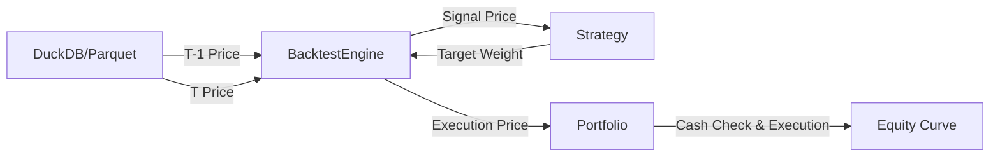
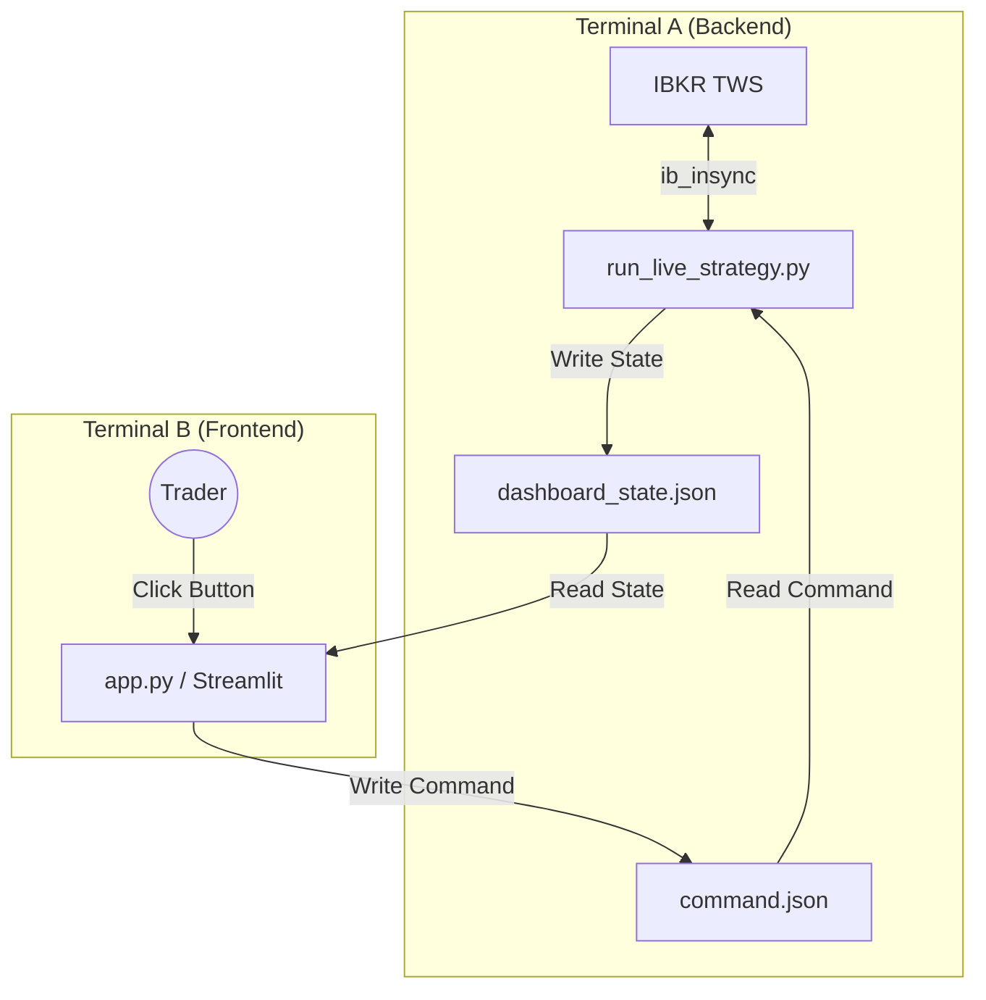

# 📈 Quantitative Multi-Factor System

## 1. 项目愿景 (Project Vision)

本项目是一个**工业级、全栈式**的量化交易系统，涵盖了从**因子挖掘、离线回测**到**实盘交易、实时监控**的完整生命周期。

核心设计哲学：

1. **真实性 (Realism)**：回测引擎严格区分**信号价格 (Signal Price)** 与 **执行价格 (Execution Price)**，并引入 **Gap Risk (跳空风险)** 模拟与 **资金硬约束**，杜绝“未来函数”与“资金透支”。
2. **解耦 (Decoupling)**：采用 **"Headless Backend + UI Frontend"** 架构。交易核心（后台）与监控面板（前台）通过状态文件异步通信，互不阻塞。
3. **模块化 (Modularity)**：策略工厂模式、配置分层管理、数据 ETL 分离。

---

## 2. 核心特性 (Key Features)

### 📊 回测引擎 (Backtest Engine V5)

* **双重价格机制**：模拟 T-1 收盘决策（定份额），T 日开盘执行（算资金）。
* **资金风控**：内置 **2% 现金缓冲 (Cash Buffer)**，防止满仓波动导致透支。
* **硬约束撮合**：执行时实时检查现金流，若遇跳空高开导致资金不足，自动执行 **Order Truncation (砍单)**。

### 🔴 实盘指挥舱 (Live Cockpit)

* **前后端分离**：
* **后台 (Worker)**：`run_live_strategy.py` 负责连接 TWS、计算信号、下单、写入状态。
* **前台 (Viewer)**：`app.py` (Streamlit) 负责读取状态、可视化展示 PnL、发送指令。


* **IPC 通信**：基于 `dashboard_state.json` 和 `command.json` 实现进程间通信。
* **应急控制**：支持 **STOP (急停)**、**FLAT (一键清仓)**、**CANCEL (撤销挂单)** 三大指令。

### 🏭 工程化架构

* **策略工厂**：`@register_strategy` 装饰器实现策略自动注册，无需修改引擎代码即可扩展。
* **配置中心**：`base.yaml` (基础) + `backtest/live.yaml` (环境) + `secrets.yaml` (隐私) 的多层合并机制。
* **DuckDB 数据仓**：Parquet 列式存储，秒级加载海量因子数据。

---

## 3. 系统架构图 (System Architecture)

### 🔄 模式 A: 离线回测 (Backtesting)



### 🔴 模式 B: 实盘监控 (Live Trading)



---

## 4. 文件结构详解 (File Manifest)

### 📂 根目录 (Root)

* **`run_backtest.py`**: **[回测入口]**
* **作用**：命令行回测工具。加载 `backtest.yaml`，初始化引擎，运行回测并保存结果。


* **`run_live_strategy.py`**: **[实盘后台 - 无头骑士]**
* **作用**：**核心交易进程**。负责连接 IB、计算信号、执行交易。它不含 UI，只负责干活并将状态写入 `data/live/`。包含“保活循环”以持续更新 PnL。


* **`app.py`**: **[全能控制台]**
* **作用**：Streamlit Web 应用。包含两个核心功能：
1. **Strategy Explorer**：可视化回测、因子分析。
2. **🔴 Live Dashboard**：实盘监控看板（读取后台状态、发送控制指令）。


* **`run_data_sync.py`**: **[数据同步]**
* **作用**：连接 IB 下载历史数据，清洗并存入 Parquet。


* **`run_factor_computation.py`**: **[因子计算]**
* **作用**：基于原始行情计算技术因子，存入 Parquet。


### 📂 config (配置中心)

* **`__init__.py`**: **[配置加载器]**
* **作用**：负责合并 `base` + `env` + `secrets` 配置文件的逻辑。


* **`base.yaml`**: 全局通用配置（数据路径、标的池路径）。
* **`backtest.yaml`**: 回测专用参数（资金量、手续费、起止日期）。
* **`live.yaml`**: 实盘专用参数（IB 端口、实盘风控阈值）。
* **`secrets.yaml`**: 敏感信息（邮件服务器密码，**不上传 Git**）。

### 📂 quant_core (核心代码库)

#### 🔹 `quant_core/backtest_engine.py` (回测引擎)

* **核心逻辑**：事件驱动引擎。负责时间切片、数据加载、以及调度 Strategy 和 Portfolio。
* **关键点**：实现了 T-1 信号与 T 日执行的时间错位模拟。

#### 🔹 `quant_core/portfolio.py` (账户账本)

* **核心逻辑**：管理现金、持仓、计算净值。
* **关键点**：**无状态设计**（不持有全量历史数据，只处理 Engine 传入的单日价格）。实现了 **2% Cash Buffer** 和 **资金不足自动砍单**。

#### 🔹 `quant_core/strategies/` (策略工厂)

* **`base.py`**: 策略基类，定义标准接口 (`on_bar`, `load_data`)。
* **`rules.py`**: 具体的线性权重策略实现。
* **`__init__.py`**: 包含 `create_strategy_instance` 工厂函数。

#### 🔹 `quant_core/live/` (实盘模块)

* **`trader.py`**: 交易执行器。负责将“目标股数”转化为 IB 订单，包含 **`cancel_all_orders`** 逻辑。
* **`data_bridge.py`**: 数据桥接。负责将 IB 实时数据清洗为策略可用的 DataFrame 格式。

---

## 5. 快速开始 (Quick Start)

### 场景一：运行回测 (Backtest)

**方式 A：命令行**

```bash
python run_backtest.py

```

**方式 B：Web UI**

```bash
streamlit run app.py
# 在侧边栏选择 "Strategy Explorer" -> 点击 "Run Backtest"

```

### 场景二：启动实盘监控 (Live Trading)

**这是双进程模式，需要开启两个终端窗口。**

#### 步骤 1：启动后台交易进程 (Terminal A)

*负责连接 TWS，执行逻辑，永不关闭。*

```bash
source venv/bin/activate
python run_live_strategy.py

```

*看到 `👁️ ...进入实时监控模式` 后，保持窗口开启。*

#### 步骤 2：启动前台监控看板 (Terminal B)

*负责显示 UI，可以随时关闭重启。*

```bash
source venv/bin/activate
streamlit run app.py

```

* 在浏览器中选择左侧 **"🔴 Live Dashboard"**。
* 开启 **Auto-Refresh** 开关。

---

## 6. 实盘操作指南 (Live Operations)

在 **Live Dashboard** 中，你可以看到三个紧急按钮：

* **🚫 CANCEL (撤单)**: 撤销所有**已提交但未成交**的挂单 (Open Orders)。适用于下单价格不合适想重下的情况。
* **📉 FLAT (清仓)**: 以**市价 (MKT)** 卖出账户内所有持仓，变现为现金。适用于极端行情避险。
* **🛑 STOP (急停)**: 强制终止后台 `run_live_strategy.py` 进程。**注意：这不会撤单也不会平仓，只是让程序停止思考。**

---

## 7. 常见问题 (FAQ)

**Q: 为什么实盘启动后卡在 "进入实时监控模式..."？**
A: 这是正常的。后台脚本进入了 `while True` 循环来维持心跳和更新 PnL。请不要关闭它，去另一个终端启动 `app.py` 查看界面。

**Q: 回测为什么报错 `KeyError: 2018-01-01`？**
A: 2018-01-01 是假期。最新版代码已修复此问题，采用了布尔索引 (`>= start_date`) 替代精确索引定位。

**Q: `Portfolio` 是怎么处理跳空高开的？**
A: `Portfolio` 在计算买入量时会预留 2% 现金。如果次日开盘价过高导致即使预留了现金也不够，系统会触发 **Hard Constraint**，自动减少买入股数，确保现金不为负。