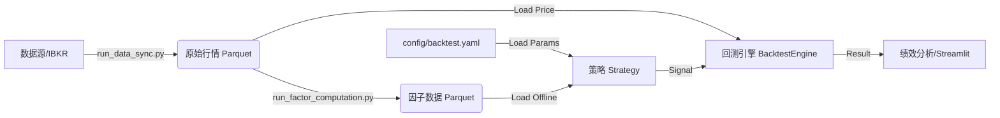
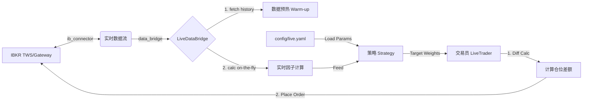

# 📈 Quantitative Multi-Factor Backtesting System

## 1. 项目愿景 (Project Vision)

本项目旨在构建一个**高性能、工程化、模块化**的量化回测框架。核心目标是支持多因子选股策略（Multi-Factor Selection）与 ETF 轮动策略的快速验证与迭代。

**核心架构特点：**

* 🚀 **离线预计算 (Pre-computation)**：彻底分离“因子计算”与“策略回测”。通过 `run_factor_computation.py` 实现因子的全量向量化计算与持久化存储，回测速度提升 **100x**。
* 🏗 **策略内聚 (Strategy Cohesion)**：采用依赖注入模式。策略类 (`BaseStrategy`) 自行持有数据并负责打分，回测引擎 (`BacktestEngine`) 仅专注于交易撮合。
* ⚙️ **配置解耦 (Config Decoupling)**：采用层级配置系统（Base + Environment），支持回测与实盘使用完全独立的参数集，防止环境污染。
* 💾 **高性能数据层**：基于 **DuckDB** 和 **Parquet** 构建本地数据仓库，支持海量行情与因子数据的秒级查询。
* ⚡ **实盘无缝切换**：采用适配器模式，通过 `LiveDataBridge` 复用回测策略逻辑，实现从回测到实盘的零代码修改迁移。

---

## 2. 当前进度 (Current Status)

**目前处于：阶段 4.5 - 架构重构与深度扩展 (Refactoring & Extension)**

* ✅ **配置系统重构**：实现了 `base.yaml` (基础设施) 与 `backtest.yaml`/`live.yaml` (环境参数) 的分离与递归合并。
* ✅ **数据仓库**：DuckDB + Parquet 架构，支持增量同步 IBKR/外部数据。
* ✅ **因子工厂**：`run_factor_computation.py` 支持 Xarray 全向量化计算与增量更新。
* ✅ **策略体系**：实现了 `LinearWeightedStrategy`（多因子线性加权 + 自动 Z-Score）。
* ✅ **回测引擎**：纯粹的事件驱动撮合引擎，支持滑点、佣金、多标的组合。
* ✅ **实盘/模拟盘对接**：基于 `ib_insync` 实现 IBKR 对接。支持自动数据预热、实时因子计算与自动下单。

---

## 3. 系统架构与数据流 (Architecture & Workflow)

本框架采用**产线分离**与**双模式运行**的设计思想：

### 模式 A: 离线回测 (Backtest)



### 模式 B: 实盘/模拟盘 (Live Trading)



---

## 4. 文件结构说明 (File Directory)

### 📂 根目录 (Root)

* **`run_backtest.py`**: **[回测入口]**
* **作用**：读取 `config/base.yaml` 和 `config/backtest.yaml`，加载离线因子，实例化策略并运行回测。


* **`run_live_strategy.py`**: **[实盘指挥官]**
* **作用**：实盘/模拟盘的主入口。连接 TWS -> 调用 Bridge 获取数据 -> 计算信号 -> 执行下单。


* **`run_factor_computation.py`**: **[因子工厂]**
* **作用**：读取全量行情，批量计算因子，并保存为 Parquet 文件。


* **`test_live_connection.py`**: **[连接测试]**
* **作用**：验证 IBKR 端口连接、数据权限及下单功能的健康检查脚本。


* **`app.py`**: **[Web 前端]**
* **作用**：Streamlit 可视化界面，用于数据探索和简易回测。


### 📂 config (配置中心) **[New]**

* **`base.yaml`**: **[基础设施配置]**
* 存放不随环境变化的全局路径（如数据存储路径、Universe 文件路径）。


* **`backtest.yaml`**: **[回测专用配置]**
* 存放回测时间段、初始资金、以及**回测时的策略参数**（如因子权重）。


* **`live.yaml`**: **[实盘专用配置]**
* 存放实盘交易账户ID、实盘更严格的风控参数、以及实盘生效的策略模型路径。


### 📂 quant_core (核心逻辑包)

#### 🔹 `quant_core/strategies/` (策略库)

* **`base.py`**: 策略基类，定义标准接口 (`load_data`, `generate_signals`)。
* **`rules.py`**: 线性策略实现 (`LinearWeightedStrategy`)。
* **`ml_strategy.py`** (Todo): 机器学习策略模板。

#### 🔹 `quant_core/live/` (实盘模块)

* **`ib_connector.py`**: 基于 `ib_insync` 的 TWS 连接器。
* **`data_bridge.py`**: 数据适配器，负责“回测-实盘”数据格式的统一。
* **`trader.py`**: 交易执行器，负责计算仓位差额并下单。

---

## 5. 开发者指南：如何新增策略 (Developer Guide)

本框架支持高度自定义。假设你想新增一个 **深度学习策略 (Deep Learning Strategy)**，请遵循以下步骤：

### 第一步：创建策略类

在 `quant_core/strategies/` 下新建 `dl_strategy.py`，继承 `BaseStrategy`。

```python
# quant_core/strategies/dl_strategy.py
import pandas as pd
from .base import BaseStrategy

class DeepLearningStrategy(BaseStrategy):
    def __init__(self, name, model_path, feature_cols, top_k=5, **kwargs):
        super().__init__(name, top_k=top_k, **kwargs)
        self.model_path = model_path
        self.feature_cols = feature_cols
        #在此处加载模型 (e.g., PyTorch/TensorFlow/Sklearn)
        # self.model = load_model(model_path) 
    
    def generate_signals(self, dt):
        """
        重写父类方法。
        根据 self.data (已加载的因子数据) 和 dt (当前时间) 生成持仓信号。
        """
        # 1. 获取截面数据
        current_features = self.get_feature_slice(dt, self.feature_cols)
        
        # 2. 模型预测
        # scores = self.model.predict(current_features)
        scores = current_features.mean(axis=1) # (示例：仅做简单平均)
        
        # 3. 排序并生成目标权重
        top_assets = scores.nlargest(self.top_k)
        
        # 4. 归一化权重 (等权)
        weights = pd.Series(1.0 / self.top_k, index=top_assets.index)
        return weights

```

### 第二步：修改配置文件

在 `config/backtest.yaml` (或 `live.yaml`) 中，将 `strategy` 节点指向你的新策略。

```yaml
strategy:
  # 1. 修改类型标识
  type: 'dl_model'  

  common:
    name: 'LSTM_Alpha_v1'
    top_k: 5
    risk:
      stop_loss_pct: 0.05

  # 2. 添加 DL 策略专用参数
  dl_params:
    model_path: 'models/lstm_v1.pth'
    feature_list: ['alpha001', 'volatility_20d', 'rsi']

```

### 第三步：注册到运行入口

修改 `run_backtest.py` (以及 `run_live_strategy.py`) 的策略初始化部分，加入新策略的分支逻辑。

```python
# run_backtest.py 中的 "阶段 2" 部分

# ... 前序代码 ...
strat_type = strat_conf.get('type', 'linear')

if strat_type == 'linear':
    # (原有逻辑)
    strategy = LinearWeightedStrategy(...)

elif strat_type == 'dl_model':
    # --- 新增分支 ---
    from quant_core.strategies.dl_strategy import DeepLearningStrategy
    
    dl_params = strat_conf.get('dl_params', {})
    
    strategy = DeepLearningStrategy(
        name=common_conf.get('name'),
        top_k=common_conf.get('top_k'),
        model_path=dl_params.get('model_path'),
        feature_cols=dl_params.get('feature_list'),
        # 注入通用风控参数
        stop_loss_pct=risk_conf.get('stop_loss_pct'),
        max_pos_weight=risk_conf.get('max_pos_weight')
    )
    
    # 别忘了加载因子数据 (如果模型需要的话)
    strategy.load_data(factor_data)

# ... 后续代码 ...

```

---

## 6. 快速开始 (Quick Start)

### 场景一：离线回测 (Backtest)

1. **准备配置**：编辑 `config/backtest.yaml`，设置你想要的策略参数。
2. **数据准备**：确保 `data/processed` 下有 parquet 数据。
3. **运行**：
```bash
python run_backtest.py

```


*程序将自动读取配置、加载因子、跑完回测并保存结果图表。*

### 场景二：实盘/模拟盘交易 (Live Trading)

1. **连接**：打开 TWS/Gateway，开启 API 端口 (默认 7497)。
2. **配置**：编辑 `config/live.yaml`，确认实盘风控参数。
3. **测试**：
```bash
python test_live_connection.py

```


4. **启动**：
```bash
python run_live_strategy.py

```


---

## 7. 后续规划 (Roadmap)

### 🚀 短期目标 (Short-term)

1. **实盘定时任务**：引入 `APScheduler`，实现开盘自动连接、收盘自动断开。
2. **更多因子**：录入 WorldQuant Alpha 101 剩余因子。

### 🌟 中期目标 (Mid-term)

1. **机器学习集成**：完善 `DeepLearningStrategy` 模板，支持 PyTorch 模型的热加载。
2. **Web 看板升级**：将 Streamlit 升级为实盘监控台，实时显示 PnL 和 Log。