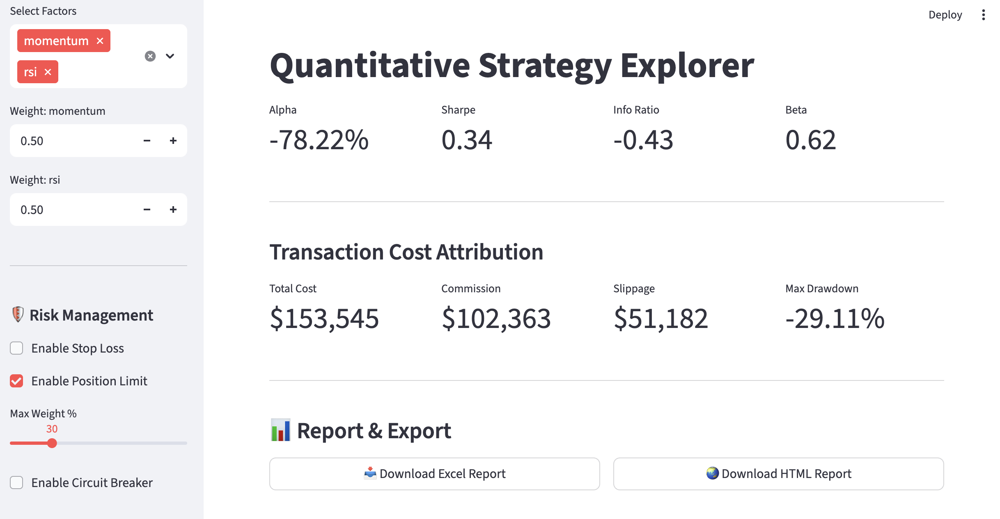
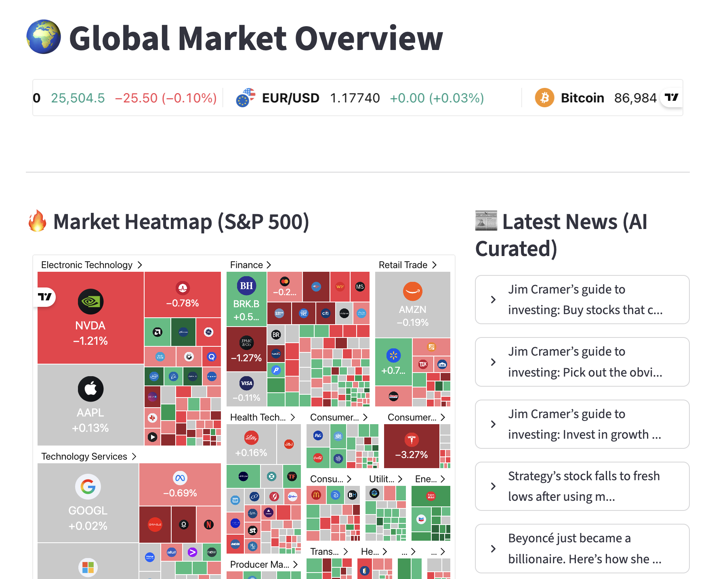
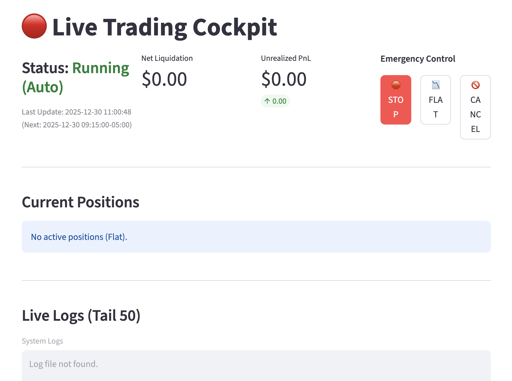
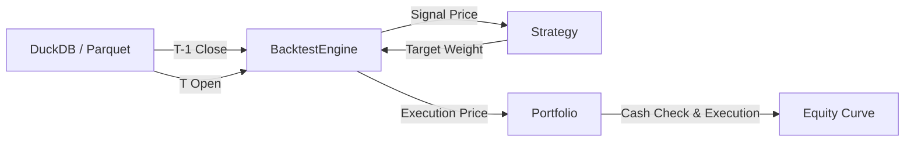
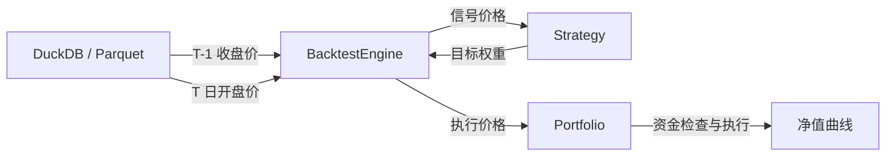
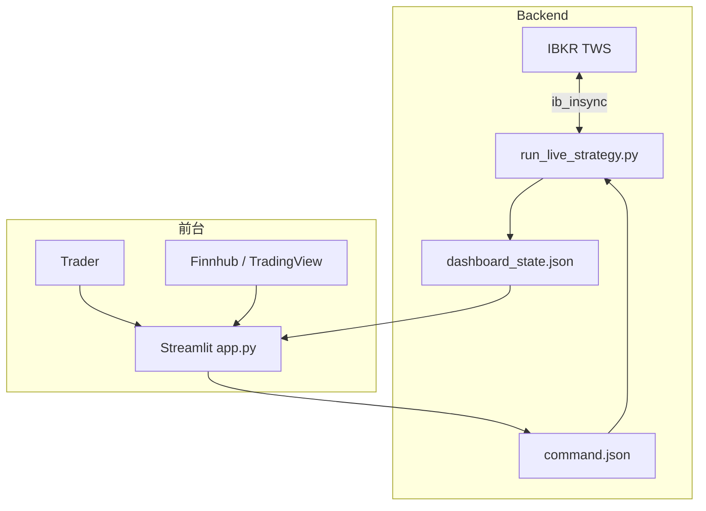

# Quantitative Multi-Factor Trading System  
Industrial-Grade Backtest & Live Trading Framework (IBKR)

<p align="center">
  <a href="#english">English</a> | <a href="#chinese">中文</a>
</p>

---

<a id="english"></a>

## English

---

## Project Showcase (YouTube)

<p align="center">
  <a href="https://youtu.be/SHqgv-NKk5A">
    
  </a>
</p>

Full walkthrough video:  
https://youtu.be/SHqgv-NKk5A

This video demonstrates how the system connects to Interactive Brokers and manages the full trading lifecycle, including architecture design, backtesting workflow, live execution, monitoring, and emergency controls.

---

## 1. Project Vision

This project is an industrial-grade, full-stack quantitative trading system covering the entire lifecycle from factor mining and offline backtesting to live trading and real-time monitoring.

### Core Design Philosophy

### 1. Realism

- The backtesting engine strictly distinguishes between:
  - Signal Price (T-1 Close)
  - Execution Price (T Open)
- Explicit simulation of gap risk
- Hard cash constraints to eliminate:
  - Future-function bias
  - Implicit leverage and overdrafts

### 2. Decoupling

- Architecture: Headless Backend + UI Frontend
- Trading core and monitoring dashboard communicate asynchronously via state files
- Frontend can be restarted independently without interrupting live trading

### 3. Modularity

- Strategy Factory pattern
- Hierarchical configuration management
- Separated data ETL, factor computation, and strategy layers

---

## 2. Key Features

### Backtest Engine

- Dual-price mechanism:
  - Decision-making at T-1 Close
  - Execution at T Open
- Built-in 2% mandatory cash buffer
- Hard constraint matching:
  - Real-time cash checks during execution
  - Automatic order truncation if gap-up causes insufficient funds
  - Guarantees non-negative cash balance

---

### Market Intelligence UI

#### Global Market Overview

- Integrated TradingView widgets:
  - Ticker Tape
  - Sector Heatmaps
- Finnhub AI-curated real-time market news



#### Stock Deep Dive

- TradingView Advanced Real-Time Charts
- Insider trading sentiment from Finnhub
- Plotly-based visualization of management confidence

---

### Live Trading Cockpit

#### Frontend–Backend Separation

Backend (Worker):
- Script: `run_live_strategy.py`
- Responsibilities:
  - Connect to IBKR TWS via ib_insync
  - Calculate trading signals
  - Place and manage orders
  - Update positions, cash, and PnL
  - Persist live state continuously

Frontend (Viewer):
- Script: `app.py` (Streamlit)
- Responsibilities:
  - Read backend state
  - Visualize positions and PnL
  - Display logs and connection status
  - Send control commands



#### IPC Communication

- State file: `dashboard_state.json`
- Command file: `command.json`

#### Emergency Controls

- CANCEL: Cancel all open (unfilled) orders
- FLAT: Liquidate all positions at market price
- STOP: Forcefully terminate the backend process (does not cancel orders or liquidate positions)

---

## 3. System Architecture

### Mode A: Backtesting


```mermaid
graph LR
    Data[DuckDB / Parquet] -->|T-1 Close| Engine[BacktestEngine]
    Data -->|T Open| Engine
    Engine -->|Signal Price| Strategy
    Strategy -->|Target Weight| Engine
    Engine -->|Execution Price| Portfolio
    Portfolio -->|Cash Check & Execution| Equity[Equity Curve]

```

---

### Mode B: Live Trading


```mermaid
graph TD
    subgraph Backend
        TWS[IBKR TWS] <-->|ib_insync| Worker[run_live_strategy.py]
        Worker --> State[dashboard_state.json]
        Command[command.json] --> Worker
    end

    subgraph Frontend
        State --> UI[Streamlit app.py]
        Trader --> UI
        UI --> Command
        External[Finnhub / TradingView] --> UI
    end

```

---

## 4. File Manifest

### Root Directory

* `run_backtest.py`
Backtest entry point. Loads `backtest.yaml`, initializes the engine, runs the simulation, and saves results.
* `run_live_strategy.py`
Headless live trading backend. Connects to IBKR, calculates signals, executes trades, and runs a keep-alive loop to update PnL.
* `app.py`
Streamlit-based all-in-one console:
1. Live Dashboard
2. Market Overview
3. Stock Deep Dive
4. Strategy Explorer


* `run_data_sync.py`
Downloads historical data from IBKR, cleans it, and stores it in Parquet format.
* `run_factor_computation.py`
Computes technical factors from raw market data and persists them to Parquet.
* `Procfile`
Process definition file for Honcho to manage multi-process execution (Trader, Bot, Web).

---

### config/

* `__init__.py`
Configuration loader implementing layered merge logic.
* `base.yaml`
Global configuration (data paths, universes).
* `backtest.yaml`
Backtest-specific parameters (capital, commission, date range).
* `live.yaml`
Live trading parameters (IB ports, risk thresholds).
* `secrets.yaml`
Sensitive credentials (API keys, tokens). Ignored by Git.

---

### quant_core/

* `backtest_engine.py`
Event-driven backtesting engine with T-1 signal and T execution separation.
* `portfolio.py`
Stateless portfolio ledger managing cash, positions, NAV, and hard constraints.
* `strategies/`
Strategy factory with base classes and concrete implementations.
* `live/`
Live trading modules:
* `trader.py` (execution)
* `data_bridge.py` (data adaptation)


* `ui/widgets.py`
TradingView HTML widget wrappers adapted for Streamlit.
* `data/external_api.py`
Finnhub API client for news and insider sentiment.

---

## 5. Quick Start

### Scenario 1: Run Backtest

Command line:

```bash
python run_backtest.py

```

Web UI:

```bash
streamlit run app.py
# Select "Strategy Explorer" -> Click "Run Backtest"

```

---

### Scenario 2: Start Live Trading

**Prerequisites:** 1. Ensure IBKR TWS or IB Gateway is running and API connections are enabled (Port 7497/4001).
2. Ensure `honcho` is installed (`pip install honcho`).

The system uses `honcho` to manage three concurrent processes defined in the `Procfile`:

* `trader`: The core trading logic (`run_live_strategy.py`)
* `bot`: The Telegram control bot (`run_telegram_bot.py`)
* `web`: The Streamlit dashboard (`app.py`)

**Start Command:**

```bash
source venv/bin/activate
honcho start

```

This single command will spin up the trading engine, the telegram bot, and the web UI simultaneously. Access the dashboard at `http://localhost:8501`.

---

## 6. Live Operations

In the Live Dashboard, three emergency commands are available:

* CANCEL: Cancels all open orders (submitted but not filled)
* FLAT: Liquidates all positions at market price
* STOP: Terminates the backend process only (does not cancel orders or liquidate positions)

---

## 7. Telegram Bot Integration

The system includes a Telegram bot for remote monitoring and basic control.

### Configuration

1. Open `config/secrets.yaml`.
2. Add your Telegram credentials:
```yaml
telegram:
  bot_token: "YOUR_BOT_TOKEN"
  chat_id: "YOUR_CHAT_ID"

```


### Usage

The bot is automatically started as the `bot` process when you run `honcho start`.

**Supported Commands:**

* `/start` - Check if the bot and trading system are online.
* `/status` - Get current PnL, Total Equity, and Active Positions.
* `/balance` - Check available cash and buying power.
* `/stop` - Emergency stop of the strategy loop (same as UI STOP).

---

## 8. Data Management (Adding New Stocks)

To add new instruments (e.g., US Stocks) to the trading universe, follow these steps:

**Step 1: Update Configuration**
Modify `config/base.yaml` to include the new ticker symbols.

```yaml
universe:
  - AAPL
  - TSLA
  - NVDA  # <--- Newly added stock

```

**Step 2: Download Historical Data**
Run the data sync script to fetch OHLCV data from IBKR.

```bash
python run_data_sync.py

```

**Step 3: Compute Factors**
Update the feature store with indicators for the new stocks.

```bash
python run_factor_computation.py

```

Once completed, the new stocks will be available for both **Backtesting** and **Live Trading**.

---

<a id="chinese"></a>

## 中文

---

## 项目展示（YouTube）

<p align="center">
<a href="https://youtu.be/SHqgv-NKk5A">

</a>
</p>

完整演示视频：
[https://youtu.be/SHqgv-NKk5A](https://youtu.be/SHqgv-NKk5A)

该视频展示了系统如何连接盈透证券（Interactive Brokers），并完成从信号生成、回测、实盘执行到实时监控的完整交易生命周期。

---

## 1. 项目愿景

本项目是一个工业级、全栈量化交易系统，覆盖从因子挖掘、离线回测到实盘交易与实时监控的完整生命周期。

### 核心设计哲学

### 1. 真实性

* 严格区分：
* 信号价格（T-1 日收盘价）
* 执行价格（T 日开盘价）


* 显式模拟跳空风险
* 引入资金硬约束，杜绝：
* 未来函数
* 资金透支与隐含杠杆


### 2. 解耦

* 架构：无界面后台 + 可视化前端
* 交易核心与监控界面通过状态文件异步通信
* 前端可随时关闭或重启，不影响实盘交易

### 3. 模块化

* 策略工厂模式
* 分层配置管理
* 数据 ETL、因子计算与策略逻辑完全解耦

---

## 2. 核心特性

### 回测引擎 V5

* 双价格机制：
* T-1 收盘生成信号
* T 日开盘执行交易


* 内置 2% 现金缓冲
* 资金硬约束撮合逻辑：
* 执行阶段实时检查现金
* 跳空高开导致资金不足时自动砍单
* 确保现金余额始终不为负


---

### 市场情报界面

#### 全球市场概览

* TradingView 组件：
* 行情条
* 行业热力图


* Finnhub AI 实时新闻流


#### 个股深度分析

* TradingView 高级实时 K 线图
* Finnhub 内部交易情绪数据
* 使用 Plotly 可视化管理层信心变化

---

### 实盘交易指挥舱

#### 前后端分离

后台（Worker）：

* 脚本：`run_live_strategy.py`
* 职责：
* 连接 IBKR TWS
* 计算交易信号
* 执行交易与订单管理
* 更新持仓、现金和盈亏
* 持续写入实盘状态


前台（Viewer）：

* 脚本：`app.py`（Streamlit）
* 职责：
* 读取后台状态
* 可视化持仓与 PnL
* 显示系统日志和连接状态
* 发送控制指令


#### 进程间通信

* 状态文件：`dashboard_state.json`
* 指令文件：`command.json`

#### 应急控制

* CANCEL：撤销所有未成交订单
* FLAT：以市价清仓所有持仓
* STOP：强制终止后台进程（不撤单、不清仓）

---

## 3. 系统架构

### 模式 A：离线回测


```mermaid
graph LR
    Data[DuckDB / Parquet] -->|T-1 收盘价| Engine[BacktestEngine]
    Data -->|T 日开盘价| Engine
    Engine -->|信号价格| Strategy
    Strategy -->|目标权重| Engine
    Engine -->|执行价格| Portfolio
    Portfolio -->|资金检查与执行| Equity[净值曲线]

```

---

### 模式 B：实盘交易


```mermaid
graph TD
    subgraph Backend
        TWS[IBKR TWS] <-->|ib_insync| Worker[run_live_strategy.py]
        Worker --> State[dashboard_state.json]
        Command[command.json] --> Worker
    end

    subgraph 前台
        State --> UI[Streamlit app.py]
        Trader --> UI
        UI --> Command
        External[Finnhub / TradingView] --> UI
    end

```

---

## 4. 文件结构详解

### 根目录

* `run_backtest.py`
回测入口，加载配置并运行完整回测流程。
* `run_live_strategy.py`
实盘交易后台进程，无界面，持续运行并更新状态。
* `app.py`
Streamlit 控制台，包含：
1. 实盘监控
2. 市场概览
3. 个股分析
4. 策略回测


* `run_data_sync.py`
从 IBKR 下载历史行情数据并存储为 Parquet。
* `run_factor_computation.py`
计算并存储技术与统计因子。
* `Procfile`
Honcho 进程配置文件，用于统筹管理多进程启动（Trader, Bot, Web）。

---

### config/

* `__init__.py`
配置合并与加载逻辑。
* `base.yaml`
全局基础配置。
* `backtest.yaml`
回测专用参数。
* `live.yaml`
实盘专用参数。
* `secrets.yaml`
密钥与凭证（不提交 Git）。

---

### quant_core/

* `backtest_engine.py`
事件驱动回测引擎，实现 T-1 信号与 T 日执行错位。
* `portfolio.py`
无状态账户账本，带 2% 现金缓冲和资金硬约束。
* `strategies/`
策略工厂、基类与具体策略实现。
* `live/`
实盘交易模块（执行与数据桥接）。
* `ui/widgets.py`
TradingView 组件封装，适配 Streamlit。
* `data/external_api.py`
Finnhub 外部数据接口。

---

## 5. 快速开始

### 回测

```bash
python run_backtest.py

```

或

```bash
streamlit run app.py
# Strategy Explorer -> Run Backtest

```

---

### 实盘（Honcho 启动模式）

**前置条件：**

1. 确保 IBKR TWS 或 IB Gateway 已经运行，并开启了 API 连接（端口 7497/4001）。
2. 确保已安装 `honcho` (`pip install honcho`)。

系统通过 `Procfile` 文件定义并管理三个并发进程：

* `trader`: 核心交易逻辑 (`run_live_strategy.py`)
* `bot`: Telegram 机器人 (`run_telegram_bot.py`)
* `web`: Streamlit 监控看板 (`app.py`)

**一键启动命令：**

```bash
source venv/bin/activate
honcho start

```

该命令会自动同时启动交易后台、机器人和 Web 界面。请访问 `http://localhost:8501` 查看看板。

---

## 6. 实盘操作指南

* CANCEL：撤销所有挂单
* FLAT：一键清仓
* STOP：终止后台交易逻辑

---

## 7. Telegram Bot 使用说明

系统内置了 Telegram Bot，用于远程监控和基础指令控制。

### 配置步骤

1. 打开配置文件 `config/secrets.yaml`。
2. 添加您的 Telegram 凭证：
```yaml
telegram:
  bot_token: "您的_BOT_TOKEN"
  chat_id: "您的_CHAT_ID"

```


### 启动与使用

当您运行 `honcho start` 时，Bot 会作为 `bot` 进程自动启动。

**支持指令：**

* `/start` - 检查 Bot 及交易系统是否在线。
* `/status` - 获取当前 PnL、总资产及活跃持仓。
* `/balance` - 查询当前可用现金和购买力。
* `/stop` - 紧急停止策略循环（同 UI 界面 STOP）。

---

## 8. 数据管理（添加新股票）

如果需要向交易系统添加新的标的（例如新增美股），请严格按照以下三个步骤操作：

**步骤 1：更新配置**
修改 `config/base.yaml` 文件，在 universe 列表中加入新代码。

```yaml
universe:
  - AAPL
  - TSLA
  - NVDA  # <--- 新加入的股票

```

**步骤 2：下载历史数据**
运行数据同步脚本，从 IBKR 下载最新的 OHLCV 数据。

```bash
python run_data_sync.py

```

**步骤 3：计算因子**
运行因子计算脚本，为新股票生成特征数据。

```bash
python run_factor_computation.py

```

完成后，新股票即可用于 **历史回测** 和 **实盘交易**。

---

## 9. 常见问题（FAQ）

Q: 为什么实盘启动后卡在“进入实时监控模式”？
A: 这是正常现象。后台脚本进入 while True 循环以维持心跳并持续更新 PnL。请保持后台运行，并在另一个终端启动前端界面。

Q: Portfolio 是如何处理跳空高开的？
A: 在买入计算时预留 2% 现金缓冲。如果次日开盘价仍导致资金不足，系统会触发资金硬约束，自动减少买入股数，确保现金不为负。