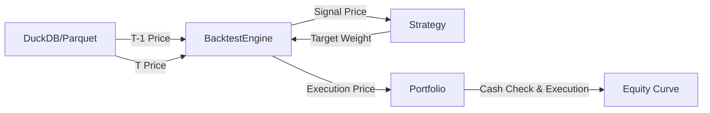
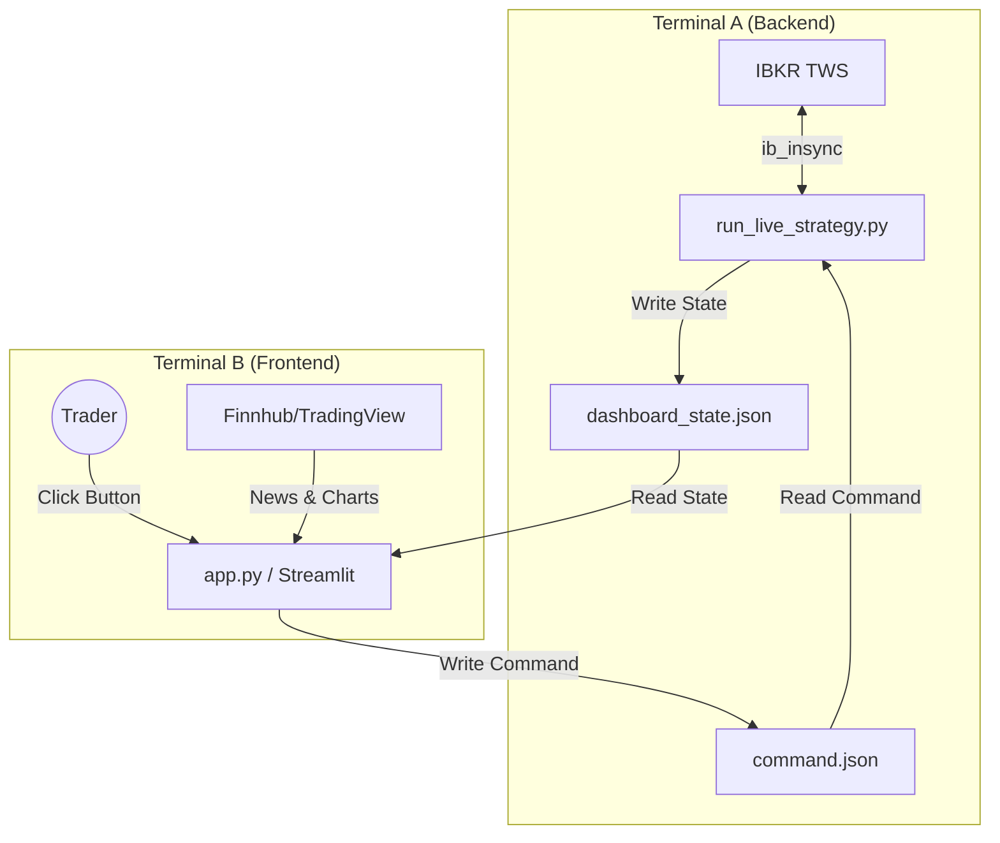

# 📈 Quantitative Multi-Factor System

[English](https://www.google.com/search?q=%23-english) | [中文](https://www.google.com/search?q=%23-%E4%B8%AD%E6%96%87)

---

## English

### 1. Project Vision

This project is an **industrial-grade, full-stack** quantitative trading system covering the entire lifecycle from **factor mining and offline backtesting** to **live trading and real-time monitoring**.

**Core Design Philosophy:**

1. **Realism**: The backtesting engine strictly distinguishes between **Signal Price** (T-1 Close) and **Execution Price** (T Open). It incorporates **Gap Risk simulation** and **Hard Cash Constraints** to eliminate "future function" bias and overdrafts.
2. **Decoupling**: Adopts a **"Headless Backend + UI Frontend"** architecture. The trading core (backend) and the monitoring dashboard (frontend) communicate asynchronously via state files, ensuring non-blocking operations.
3. **Modularity**: Implements Strategy Factory pattern, hierarchical configuration management, and separated Data ETL pipelines.

---

### 2. Key Features

#### 📊 Backtest Engine V5

* **Dual-Price Mechanism**: Simulates decision-making at T-1 Close (determining target shares) and execution at T Open (calculating cash flow).
* **Risk Control**: Built-in **2% Cash Buffer** to prevent overdrafts caused by market volatility.
* **Hard Constraint Matching**: Real-time cash flow checks during execution. If a gap-up opening leads to insufficient funds, **Order Truncation** is automatically triggered.

#### 🌍 Market Intelligence UI (New)

* **Global Market Overview**: Integrated **TradingView** widgets (Ticker Tape, Sector Heatmaps) and **Finnhub** AI-curated news streams for macro analysis.
* **Stock Deep Dive**: Professional-grade **Advanced Real-time Charts** and **Insider Sentiment Analysis** (visualized via Plotly) to track management confidence.

#### 🔴 Live Cockpit

* **Frontend-Backend Separation**:
* **Backend (Worker)**: `run_live_strategy.py` handles IBKR TWS connection, signal calculation, order placement, and state writing.
* **Frontend (Viewer)**: `app.py` (Streamlit) reads the state file, visualizes PnL, and sends commands.


* **IPC Communication**: Inter-process communication based on `dashboard_state.json` and `command.json`.
* **Emergency Control**: Supports **STOP (Emergency Stop)**, **FLAT (Liquidate All)**, and **CANCEL (Cancel Open Orders)** commands.

#### 🏭 Engineering Architecture

* **Strategy Factory**: `@register_strategy` decorator enables automatic strategy registration, allowing extension without modifying the engine code.
* **Configuration Center**: Multi-layer merging mechanism: `base.yaml` (Base) + `backtest/live.yaml` (Environment) + `secrets.yaml` (Credentials).
* **DuckDB Data Warehouse**: Parquet columnar storage for sub-second loading of massive factor data.

---

### 3. System Architecture

#### 🔄 Mode A: Backtesting


```mermaid
graph LR
    Data[DuckDB/Parquet] -->|T-1 Price| Engine[BacktestEngine]
    Data -->|T Price| Engine
    Engine -->|Signal Price| Strat[Strategy]
    Strat -->|Target Weight| Engine
    Engine -->|Execution Price| Port[Portfolio]
    Port -->|Cash Check & Execution| Result[Equity Curve]

```

#### 🔴 Mode B: Live Trading


```mermaid
graph TD
    subgraph "Terminal A (Backend)"
        TWS[IBKR TWS] <-->|ib_insync| Worker[run_live_strategy.py]
        Worker -->|Write State| JSON[dashboard_state.json]
        CMD[command.json] -->|Read Command| Worker
    end

    subgraph "Terminal B (Frontend)"
        JSON -->|Read State| App[app.py / Streamlit]
        User((Trader)) -->|Click Button| App
        App -->|Write Command| CMD
        External[Finnhub/TradingView] -->|News & Charts| App
    end

```

---

### 4. File Manifest

#### 📂 Root Directory

* **`run_backtest.py`**: **[Backtest Entry]**
* Command-line tool. Loads `backtest.yaml`, initializes the engine, runs the simulation, and saves results.


* **`run_live_strategy.py`**: **[Live Backend - Headless Worker]**
* **Core Trading Process**. Connects to IB, calculates signals, and executes trades. It has no UI and writes status to `data/live/`. Includes a "Keep-Alive Loop" to continuously update PnL.


* **`app.py`**: **[All-in-One Console]**
* Streamlit Web Application. Includes **four** main modules:
1. **🔴 Live Dashboard**: Live trading monitor (reads backend state, sends commands).
2. **🌍 Market Overview**: Global market heatmaps and real-time news aggregation.
3. **🔍 Stock Deep Dive**: Technical charts and fundamental/sentiment analysis for individual assets.
4. **Strategy Explorer**: Visualization for backtesting and factor analysis.


* **`run_data_sync.py`**: **[Data Sync]**
* Connects to IB to download historical data, cleans it, and saves it to Parquet.


* **`run_factor_computation.py`**: **[Factor Computation]**
* Calculates technical factors based on raw market data and saves to Parquet.


#### 📂 config (Configuration Center)

* **`__init__.py`**: **[Config Loader]**
* Logic for merging `base` + `env` + `secrets` configuration files.


* **`base.yaml`**: Global settings (Data paths, Universe paths).
* **`backtest.yaml`**: Backtest-specific params (Initial capital, Commission, Date range).
* **`live.yaml`**: Live-specific params (IB port, Risk thresholds).
* **`secrets.yaml`**: Sensitive info (Email passwords, Telegram tokens, **Finnhub API Keys**). **Ignored by Git**.

#### 📂 quant_core (Core Library)

* **`quant_core/backtest_engine.py`**: Event-driven engine handling time slicing, data loading, and scheduling Strategy/Portfolio.
* **`quant_core/portfolio.py`**: Ledger managing cash, positions, and NAV. Features stateless design and hard constraints.
* **`quant_core/strategies/`**: Strategy factory containing base classes and specific rule implementations.
* **`quant_core/live/`**: Live trading modules including `trader.py` (Execution) and `data_bridge.py` (Data adaption).
* **`quant_core/ui/widgets.py`**: **[UI Component Library]** Wrappers for TradingView HTML5 widgets (Advanced Chart, Ticker Tape) adapted for Streamlit.
* **`quant_core/data/external_api.py`**: **[External Data Service]** Client for Finnhub API to fetch market news and insider sentiment.

---

### 5. Quick Start

#### Scenario 1: Run Backtest

**Option A: Command Line**

```bash
python run_backtest.py

```

**Option B: Web UI**

```bash
streamlit run app.py
# Select "Strategy Explorer" in the sidebar -> Click "Run Backtest"

```

#### Scenario 2: Start Live Trading

**This requires Dual-Process Mode (Two Terminal Windows).**

**Step 1: Start Backend Process (Terminal A)**
*Connects to TWS, executes logic, runs forever.*

```bash
source venv/bin/activate
python run_live_strategy.py

```

*Keep this window open after seeing `👁️ ...Entering Live Monitor Mode`.*

**Step 2: Start Frontend Dashboard (Terminal B)**
*UI display, can be closed/restarted anytime.*

```bash
source venv/bin/activate
streamlit run app.py

```

* Select **"🔴 Live Dashboard"** in the sidebar.
* Toggle **Auto-Refresh** on.

---

### 6. Live Operations

In the **Live Dashboard**, you have three emergency buttons:

* **🚫 CANCEL**: Cancels all **Open Orders** (Submitted but not filled). Useful when you want to replace orders.
* **📉 FLAT**: Liquidates all positions at **Market Price (MKT)** and converts to cash. Useful for extreme risk aversion.
* **🛑 STOP**: Forcefully terminates the backend `run_live_strategy.py` process. **Note: This does NOT cancel orders or liquidate positions; it only stops the program logic.**

---

## 中文

### 1. 项目愿景 (Project Vision)

本项目是一个**工业级、全栈式**的量化交易系统，涵盖了从**因子挖掘、离线回测**到**实盘交易、实时监控**的完整生命周期。

**核心设计哲学：**

1. **真实性 (Realism)**：回测引擎严格区分**信号价格 (Signal Price)** 与 **执行价格 (Execution Price)**，并引入 **Gap Risk (跳空风险)** 模拟与 **资金硬约束**，杜绝“未来函数”与“资金透支”。
2. **解耦 (Decoupling)**：采用 **"Headless Backend + UI Frontend"** 架构。交易核心（后台）与监控面板（前台）通过状态文件异步通信，互不阻塞。
3. **模块化 (Modularity)**：策略工厂模式、配置分层管理、数据 ETL 分离。

---

### 2. 核心特性 (Key Features)

#### 📊 回测引擎 (Backtest Engine V5)

* **双重价格机制**：模拟 T-1 收盘决策（定份额），T 日开盘执行（算资金）。
* **资金风控**：内置 **2% 现金缓冲 (Cash Buffer)**，防止满仓波动导致透支。
* **硬约束撮合**：执行时实时检查现金流，若遇跳空高开导致资金不足，自动执行 **Order Truncation (砍单)**。

#### 🌍 市场情报系统 (Market Intelligence UI) - 新增

* **全球市场概览**：集成 **TradingView** 组件（行情条、板块热力图）与 **Finnhub** AI 筛选的实时新闻流，提供宏观市场视角。
* **个股深度分析**：提供全屏级 **高级实时 K 线图** 与 **内部交易情绪 (Insider Sentiment)** 分析（基于 Plotly 可视化管理层信心）。

#### 🔴 实盘指挥舱 (Live Cockpit)

* **前后端分离**：
* **后台 (Worker)**：`run_live_strategy.py` 负责连接 TWS、计算信号、下单、写入状态。
* **前台 (Viewer)**：`app.py` (Streamlit) 负责读取状态、可视化展示 PnL、发送指令。


* **IPC 通信**：基于 `dashboard_state.json` 和 `command.json` 实现进程间通信。
* **应急控制**：支持 **STOP (急停)**、**FLAT (一键清仓)**、**CANCEL (撤销挂单)** 三大指令。

#### 🏭 工程化架构

* **策略工厂**：`@register_strategy` 装饰器实现策略自动注册，无需修改引擎代码即可扩展。
* **配置中心**：`base.yaml` (基础) + `backtest/live.yaml` (环境) + `secrets.yaml` (隐私) 的多层合并机制。
* **DuckDB 数据仓**：Parquet 列式存储，秒级加载海量因子数据。

---

### 3. 系统架构图 (System Architecture)

#### 🔄 模式 A: 离线回测 (Backtesting)


```mermaid
graph LR
    Data[DuckDB/Parquet] -->|T-1 Price| Engine[BacktestEngine]
    Data -->|T Price| Engine
    Engine -->|Signal Price| Strat[Strategy]
    Strat -->|Target Weight| Engine
    Engine -->|Execution Price| Port[Portfolio]
    Port -->|Cash Check & Execution| Result[Equity Curve]

```

#### 🔴 模式 B: 实盘监控 (Live Trading)


```mermaid
graph TD
    subgraph "Terminal A (Backend)"
        TWS[IBKR TWS] <-->|ib_insync| Worker[run_live_strategy.py]
        Worker -->|Write State| JSON[dashboard_state.json]
        CMD[command.json] -->|Read Command| Worker
    end

    subgraph "Terminal B (Frontend)"
        JSON -->|Read State| App[app.py / Streamlit]
        User((Trader)) -->|Click Button| App
        App -->|Write Command| CMD
        External[Finnhub/TradingView] -->|News & Charts| App
    end

```

---

### 4. 文件结构详解 (File Manifest)

#### 📂 根目录 (Root)

* **`run_backtest.py`**: **[回测入口]**
* 命令行回测工具。加载 `backtest.yaml`，初始化引擎，运行回测并保存结果。


* **`run_live_strategy.py`**: **[实盘后台 - 无头骑士]**
* **核心交易进程**。负责连接 IB、计算信号、执行交易。它不含 UI，只负责干活并将状态写入 `data/live/`。包含“保活循环”以持续更新 PnL。


* **`app.py`**: **[全能控制台]**
* Streamlit Web 应用。包含**四个**核心模块：
1. **🔴 Live Dashboard**: 实盘监控看板（读取后台状态、发送控制指令）。
2. **🌍 Market Overview**: 全球市场热力图与实时新闻聚合。
3. **🔍 Stock Deep Dive**: 个股技术面（K线）与基本面（情绪）深度分析。
4. **Strategy Explorer**: 策略回测与因子分析可视化。


* **`run_data_sync.py`**: **[数据同步]**
* 连接 IB 下载历史数据，清洗并存入 Parquet。


* **`run_factor_computation.py`**: **[因子计算]**
* 基于原始行情计算技术因子，存入 Parquet。


#### 📂 config (配置中心)

* **`__init__.py`**: **[配置加载器]**
* 负责合并 `base` + `env` + `secrets` 配置文件的逻辑。


* **`base.yaml`**: 全局通用配置（数据路径、标的池路径）。
* **`backtest.yaml`**: 回测专用参数（资金量、手续费、起止日期）。
* **`live.yaml`**: 实盘专用参数（IB 端口、实盘风控阈值）。
* **`secrets.yaml`**: 敏感信息（邮件服务器密码，Telegram Token，**Finnhub API Keys**）。**不上传 Git**。

#### 📂 quant_core (核心代码库)

* **`quant_core/backtest_engine.py`** (回测引擎): 事件驱动引擎。负责时间切片、数据加载、以及调度 Strategy 和 Portfolio。实现了 T-1 信号与 T 日执行的时间错位模拟。
* **`quant_core/portfolio.py`** (账户账本): 管理现金、持仓、计算净值。**无状态设计**（不持有全量历史数据，只处理 Engine 传入的单日价格）。实现了 **2% Cash Buffer** 和 **资金不足自动砍单**。
* **`quant_core/strategies/`** (策略工厂): 包含 `base.py` (基类), `rules.py` (具体策略), 和 `__init__.py` (工厂函数)。
* **`quant_core/live/`** (实盘模块): 包含 `trader.py` (交易执行) 和 `data_bridge.py` (数据桥接)。
* **`quant_core/ui/widgets.py`**: **[UI 组件库]** 封装 TradingView HTML5 原生组件（高级 K 线、行情条），适配 Streamlit 布局。
* **`quant_core/data/external_api.py`**: **[外部数据服务]** Finnhub API 客户端，负责获取实时新闻流与内部交易情绪数据。

---

### 5. 快速开始 (Quick Start)

#### 场景一：运行回测 (Backtest)

**方式 A：命令行**

```bash
python run_backtest.py

```

**方式 B：Web UI**

```bash
streamlit run app.py
# 在侧边栏选择 "Strategy Explorer" -> 点击 "Run Backtest"

```

#### 场景二：启动实盘监控 (Live Trading)

**这是双进程模式，需要开启两个终端窗口。**

**步骤 1：启动后台交易进程 (Terminal A)**
*负责连接 TWS，执行逻辑，永不关闭。*

```bash
source venv/bin/activate
python run_live_strategy.py

```

*看到 `👁️ ...进入实时监控模式` 后，保持窗口开启。*

**步骤 2：启动前台监控看板 (Terminal B)**
*负责显示 UI，可以随时关闭重启。*

```bash
source venv/bin/activate
streamlit run app.py

```

* 在浏览器中选择左侧 **"🔴 Live Dashboard"**。
* 开启 **Auto-Refresh** 开关。

---

### 6. 实盘操作指南 (Live Operations)

在 **Live Dashboard** 中，你可以看到三个紧急按钮：

* **🚫 CANCEL (撤单)**: 撤销所有**已提交但未成交**的挂单 (Open Orders)。适用于下单价格不合适想重下的情况。
* **📉 FLAT (清仓)**: 以**市价 (MKT)** 卖出账户内所有持仓，变现为现金。适用于极端行情避险。
* **🛑 STOP (急停)**: 强制终止后台 `run_live_strategy.py` 进程。**注意：这不会撤单也不会平仓，只是让程序停止思考。**

---

### 7. 常见问题 (FAQ)

**Q: 为什么实盘启动后卡在 "进入实时监控模式..."？**
A: 这是正常的。后台脚本进入了 `while True` 循环来维持心跳和更新 PnL。请不要关闭它，去另一个终端启动 `app.py` 查看界面。

**Q: 回测为什么报错 `KeyError: 2018-01-01`？**
A: 2018-01-01 是假期。最新版代码已修复此问题，采用了布尔索引 (`>= start_date`) 替代精确索引定位。

**Q: `Portfolio` 是怎么处理跳空高开的？**
A: `Portfolio` 在计算买入量时会预留 2% 现金。如果次日开盘价过高导致即使预留了现金也不够，系统会触发 **Hard Constraint**，自动减少买入股数，确保现金不为负。